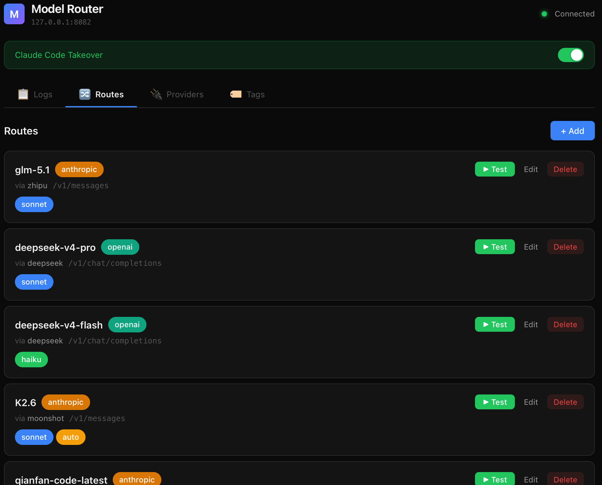
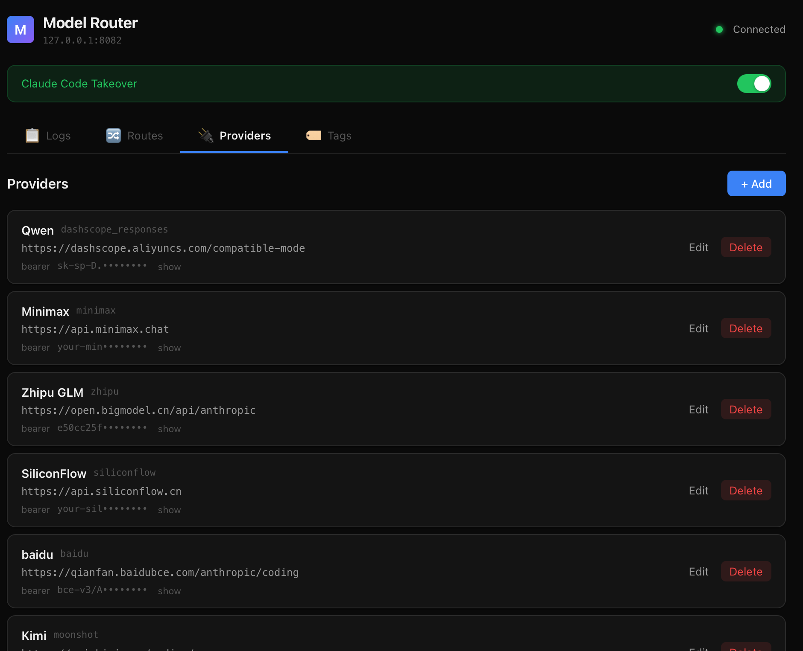
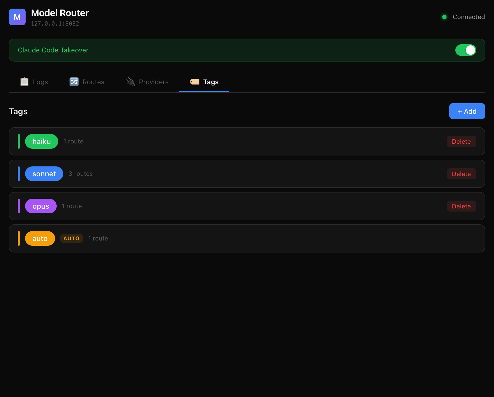
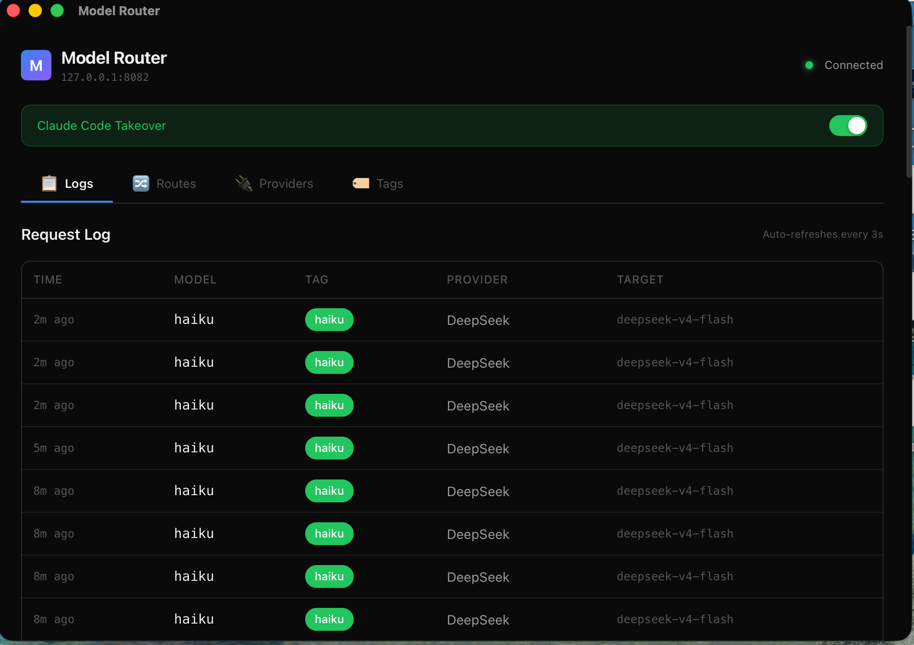

# 用国产模型跑 Claude Code，每年省下几千块

## 先算一笔账

Claude Code 的工作方式是：**根据任务复杂度，自动切换模型**。

- 简单问题 → haiku
- 日常编码 → sonnet
- 复杂推理 → opus

这个设计很聪明。但问题是：**Anthropic 的 opus 很贵，sonnet 也不便宜**。

以一个典型工作日为例，Claude Code 大约发出 200-400 次请求，其中：

| 模型 | 占比 | 单次 token 成本 | 日成本（估算） |
|------|------|----------------|--------------|
| opus | ~20% | $0.015/1K | $3-5 |
| sonnet | ~60% | $0.003/1K | $2-4 |
| haiku | ~20% | $0.0003/1K | $0.1 |

**一天 $5-10，一个月 $150-300，一年 $2000-4000。**

如果 opus 走智谱 GLM（价格约为 Anthropic 的 1/10），sonnet 走 DeepSeek Pro，haiku 走 DeepSeek Flash——**同样的工作流，成本可以降到原来的 1/5 甚至更低**。

但问题来了：**怎么让 Claude Code 的 opus/sonnet/haiku 请求，分别走到不同的国产模型上？**

## AginxLLM：模型路由器



**AginxLLM** 是一个开源桌面应用（Tauri v2 + Rust），位于 Claude Code 和模型提供商之间，做两件事：

1. **按标签路由**：opus → 智谱 GLM，sonnet → DeepSeek Pro，haiku → DeepSeek Flash
2. **协议转换**：Claude Code 用 Anthropic Messages 协议，但 DeepSeek 只认 OpenAI Chat 协议——AginxLLM 自动转换

**Claude Code 的智能调度能力不变，但推理成本大幅降低。**

### 它不是简单的代理

普通代理只能把请求原样转发，要求两边用同一个协议。AginxLLM 不一样——它是**协议感知的智能路由**：

```
Claude Code 发出：                   AginxLLM 转发到：
POST /v1/messages                   POST /v1/chat/completions
{                                   {
  "model": "opus",        →           "model": "glm-5.1",
  "messages": [...],                  "messages": [...],
  "max_tokens": 4096                  "max_tokens": 4096
}                                   }
```

请求格式、响应格式、流式 SSE，全部自动转换。对 Claude Code 来说，它以为自己在跟 Anthropic API 通信；对 provider 来说，它以为自己在服务一个 OpenAI 格式的客户端。

## 三大核心功能

### 一、标签路由——把 Claude Code 的调度能力用到国产模型上



Claude Code 内部会根据任务难度，在 opus/sonnet/haiku 之间自动切换。AginxLLM 利用这个机制，把每个档位路由到不同的国产模型：

```
opus   → 智谱 GLM (glm-5.1)        ← 强推理能力，价格是 Opus 的 1/10
sonnet → DeepSeek (deepseek-v4-pro)  ← 编码能力出色，价格是 Sonnet 的 1/5
haiku  → DeepSeek (deepseek-v4-flash) ← 极速响应，几乎不花钱
auto   → Moonshot Kimi (K2.6)        ← 未识别模型自动走这里
```

**你不需要改变 Claude Code 的任何使用习惯。** 该用 opus 还是用 opus，只是背后实际跑的是智谱 GLM。

### 二、协议转换——三种主流格式任意互转



不同提供商用不同的 API 格式，AginxLLM 支持三向互转：

| 客户端格式 | Provider 格式 | 典型场景 |
|-----------|-------------|---------|
| Anthropic Messages | OpenAI Chat Completions | DeepSeek、Moonshot、SiliconFlow |
| Anthropic Messages | OpenAI Responses API | 通义千问 DashScope |
| Anthropic Messages | Anthropic（透传） | 百度文心、智谱 GLM |
| OpenAI Responses API | OpenAI Chat Completions | Codex CLI → DeepSeek |
| OpenAI Responses API | Anthropic Messages | Codex CLI → 智谱 GLM |

流式 SSE 转换同样完整支持，thinking 块、text 块、tool_use 块全部正确处理。

### 三、一键接管——零配置，开关即用



不需要手动改环境变量。管理界面点击 "Takeover"：

**Claude Code 接管**：自动写入 `~/.claude/settings.json`

```json
{
  "env": {
    "ANTHROPIC_MODEL": "auto",
    "ANTHROPIC_BASE_URL": "http://127.0.0.1:8082/anthropic",
    "ANTHROPIC_DEFAULT_OPUS_MODEL": "opus",
    "ANTHROPIC_DEFAULT_SONNET_MODEL": "sonnet",
    "ANTHROPIC_DEFAULT_HAIKU_MODEL": "haiku"
  }
}
```

**Codex CLI 接管**：自动写入 `~/.codex/config.toml`

```toml
model = "gpt-5.5"
model_provider = "model-router"

[model_providers.model-router]
name = "AginxLLM"
base_url = "http://127.0.0.1:8082"
wire_api = "responses"
```

点击 "Restore" 一键恢复原始配置，零风险。

## Codex CLI 支持

v0.2.0 新增了对 OpenAI Codex CLI 的支持。Codex 使用 **OpenAI Responses API** 协议（和 Claude Code 的 Anthropic Messages 完全不同），AginxLLM 现在可以：

- 把 Codex 的 Responses API 请求转换为 OpenAI Chat 或 Anthropic Messages 格式
- 流式 SSE 双向转换
- 一键写入 Codex 配置文件

这意味着：**同一个 AginxLLM 实例，同时服务 Claude Code 和 Codex CLI，共用同一套路由规则。**

## 还解决了三个"坑"

### 坑一：Thinking Blocks 协议变更

Claude Code 2.1.x 引入 Opus 4.8 后大量使用 thinking blocks。国产 provider 不一定支持。AginxLLM 自动处理：

- provider 返回 thinking 块 → 正确透传
- DeepSeek 的 `reasoning_content` → 自动转换为 `thinking` 块
- 流式中对 `block_index` 做状态机管理，防止索引错乱

### 坑二：模型名反馈循环

Claude Code 会"记住" provider 返回的模型名，导致下次请求绕过路由。AginxLLM 在返回响应前，**将 provider 的模型名替换为原始别名**：

```
provider 返回: model: "glm-5.1"
AginxLLM 替换: model: "opus"
```

反馈循环被彻底切断。

### 坑三：协议格式不兼容

Claude Code 用 Anthropic 格式，Codex 用 Responses 格式，国产模型用 OpenAI 格式——三种协议互不兼容。AginxLLM 的三向转换引擎解决了这个问题。

## 架构

```
  Claude Code              Codex CLI
  (Anthropic Messages)     (OpenAI Responses)
         │                        │
         ▼                        ▼
  ┌──────────────────────────────────────┐
  │         AginxLLM                 │
  │  ┌────────────┐  ┌────────────────┐  │
  │  │ Protocol   │  │ Tag Router     │  │
  │  │ Converter  │  │ opus→GLM       │  │
  │  │ 3-way      │  │ sonnet→DeepSeek│  │
  │  │ transform  │  │ haiku→Flash    │  │
  │  └────────────┘  └────────────────┘  │
  └──────────┬──────────────┬────────────┘
             │              │
     ┌───────▼───┐  ┌──────▼──────┐
     │ OpenAI    │  │ Anthropic   │
     │ (DeepSeek,│  │ (Baidu,     │
     │  Moonshot)│  │  Zhipu GLM) │
     └───────────┘  └─────────────┘
```

- **系统托盘常驻**：关闭窗口不退出，后台持续运行
- **管理界面**：浏览器打开 `http://127.0.0.1:8082`，实时日志、配置管理
- **零依赖部署**：macOS .app / Windows .exe，双击即用

## 和其他方案对比

| 方案 | 协议转换 | 标签路由 | 模型反馈 | Codex 支持 | 开源 |
|-----|---------|---------|---------|-----------|------|
| **手动配环境变量** | ❌ | ❌ | ❌ | ❌ | - |
| **普通 HTTP 代理** | ❌ 必须同协议 | ❌ | ❌ | ❌ | - |
| **降级旧版本** | ❌ | ❌ | ❌ | ❌ | - |
| **AginxLLM** | ✅ 三向互转 | ✅ opus/sonnet/haiku | ✅ 自动替换 | ✅ | ✅ MIT |

## 快速上手

### 方式一：下载安装包（推荐）

从 [GitHub Releases](https://github.com/yinnho/model-router/releases) 下载对应平台的安装包：

| 平台 | 安装包 | 说明 |
|------|--------|------|
| **macOS** | `AginxLLM_aarch64.dmg` | Apple Silicon，拖到 Applications |
| **Windows** | `ModelRouter_x64-setup.exe` | 双击安装 |
| **Linux** | `ModelRouter_x86_64.AppImage` | `chmod +x` 运行 |

### 方式二：源码编译

```bash
git clone https://github.com/yinnho/model-router
cd model-router
npm --prefix web install
npm --prefix web run tauri dev     # 开发模式
npm --prefix web run tauri build   # 构建安装包
```

### 配置

安装后编辑 `~/.model-router/config.yaml`，配置你的 provider 和路由规则，然后在管理界面点击 "Takeover"——完成。

## 写在最后

AginxLLM 的核心理念很简单：**Claude Code 的智能调度很好，但不一定要用 Anthropic 的模型来执行。** 把 opus/sonnet/haiku 的调度能力，和国产模型的性价比结合起来——这就是 AginxLLM 做的事。

不需要降级。不需要折腾环境变量。不需要担心协议不兼容。

---

项目地址：[https://github.com/yinnho/model-router](https://github.com/yinnho/model-router)

开源免费，欢迎 Star、Issue、PR。
