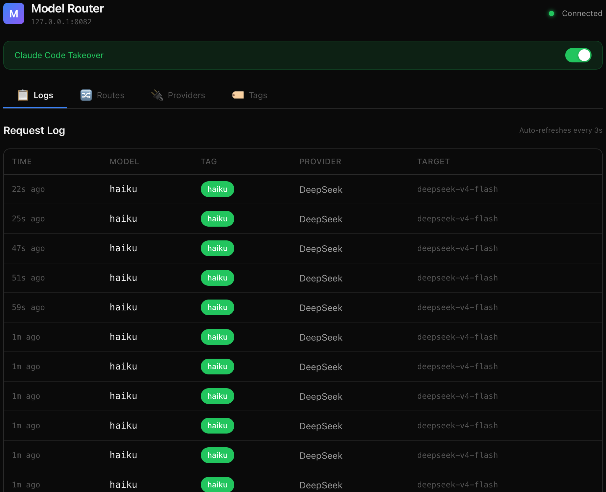

<div align="center">

# AginxBrain

**Open-source AI gateway · Bidirectional protocol conversion · Tag-based routing**

Speak Anthropic, OpenAI, or Responses on the client side — any of them on the provider side. AginxBrain converts between them, routes by quality tier, and fails over automatically.

[](https://github.com/yinnho/AginxBrain/releases)
[](./LICENSE)
[](https://github.com/yinnho/AginxBrain/releases)
[](https://www.rust-lang.org/)

[Features](#features) · [Architecture](#architecture) · [Quick Start](#quick-start) · [Configuration](#configuration) · [Comparison](#comparison)

</div>

---

AginxBrain sits between your AI client (Claude Code, Codex CLI, any OpenAI / Anthropic / Responses SDK) and your model providers, and does four things transparently:

1. **Protocol conversion** — clients speak Anthropic Messages, OpenAI Chat, *or* OpenAI Responses; providers speak any of the three. All **9 combinations**, both directions, **streaming included**.
2. **Tag-based routing** — route by quality tier (`opus` / `sonnet` / `haiku` / `auto`) instead of hard-coding model names, with multi-candidate failover chains.
3. **Reliability** — per-route circuit breaker, automatic failover on retryable errors, smart auto-routing that upgrades the tier based on the request, hot-reloaded config.
4. **Key custody & observability** — providers' real keys live in one place behind per-caller API keys; every request is logged with token usage and estimated cost.

It runs in two shapes:

- **Server (the gateway)** — a single self-hosted binary. Holds all the keys, runs the proxy, embeds an admin dashboard at `http://host:port/`.
- **Desktop (the client)** — a thin Tauri app whose only job is to flip your Claude Code / Codex config to point at a server (yours or a hosted one). No local proxy, no keys on disk.

> AginxBrain 是 [Aginx](https://github.com/yinnho) Agent 互联网生态中的「大脑」层：Agent 只表达需求（对话、生图、语音……），AginxBrain 负责选 provider、转格式、failover、审计。

---

## Features

### 🔄 Bidirectional protocol conversion (the 9-way matrix)

| Client ↓ / Provider → | OpenAI Chat | OpenAI Responses | Anthropic |
|---|:---:|:---:|:---:|
| **Anthropic Messages** (Claude Code) | ✅ | ✅ | ✅ passthrough |
| **OpenAI Chat** | ✅ passthrough | ✅ | ✅ |
| **OpenAI Responses** (Codex CLI) | ✅ | ✅ passthrough | ✅ |

Streaming SSE is fully converted across formats — `thinking`, `text`, `tool_use`, and `usage` all translate correctly. Send `stream: true` with `stream_options: {include_usage: true}` and the final chunk carries correct token counts.

### 🏷️ Tag routing, failover & circuit breaker

Route by quality tier, not vendor lock-in:

```
opus   → Zhipu GLM-5.1          (strongest)
sonnet → DeepSeek v4-pro         (balanced)  ──┐ failover chain
haiku  → DeepSeek v4-flash       (fast)       │ on 429 / timeout / 5xx
auto   → smart-routing decides   (adaptive)  ──┘
```

- Each tag resolves to an ordered list of candidate routes; the next route is tried when the current one fails with a **retryable** error (timeout, 5xx, 429, connection error).
- **Circuit breaker** — a route that fails **3 times in a row** is opened for a **60s cooldown**, then probed once (half-open) before traffic resumes. Keyed per-route, in-memory only.
- Unrecognized model names fall back to `auto` — no request is ever dropped.

### 🧠 Smart auto-routing

When a request arrives on the `auto` tag, AginxBrain inspects the body and dynamically upgrades the tier:

| Signal | Example | Routes to |
|---|---|---|
| `agentic` | request carries `tools` / tool calls | sonnet |
| `reasoning` | "think step by step" / 推理 markers | opus |
| `complex_coding` | heavy Edit/Write/Bash patterns | opus |
| `code_pattern` | fenced code blocks | sonnet |
| `subagent` | short system prompt + delegated task | haiku |

A per-session, **upgrade-only** cache (30 min TTL) means once a conversation needs a strong model, it never downgrades. Zero ML, pure string/JSON matching, sub-millisecond overhead. Fully configurable via `signal_tiers` in `config.yaml`.

### 🛡️ Production-grade reliability

- **Per-modality timeouts**: 45s non-streaming, 120s for reasoning, 3600s streaming, 10s connect.
- **Circuit breaker** prevents failover storms from hammering a dead provider.
- `reasoning_content` stripped from fast/haiku tiers so classifiers and simple chat stay clean.
- `output_tokens` is always present in usage (safety-filled when a provider omits it) so clients that divide by token count never crash.

### 🔑 Auth, keys & cost tracking

- **Admin access** — session-based login (username/password), set up on first run. `management_key` is legacy and ignored for auth.
- **Per-caller API keys** — hashed in SQLite, plaintext shown once at creation. Send as `Authorization: Bearer <key>` (OpenAI / Codex) or `x-api-key: <key>` (Anthropic / Claude Code).
- **Usage & cost** — every request logged with input/output tokens + estimated cost, aggregated daily / monthly / all-time, per caller. Per-provider-per-model cost rates are configurable.
- **Provider health dashboard** — success rate, average latency, token volume, and live circuit state per provider.

### 🎨 Multimodal

Image generation (DashScope `wan2.7`, MiniMax, OpenAI images), TTS & ASR (DashScope WebSocket, Whisper), vision, and video synthesis — all behind the same tag-routing surface, dispatched by the route's `format`.

### 🔌 One-click client takeover

The desktop client (or the admin UI) rewrites your real client config for you, with one-click restore:

- **Claude Code** — writes `~/.claude/settings.json` (`ANTHROPIC_BASE_URL` + token) to point at your AginxBrain server.
- **Codex CLI** — writes `~/.codex/config.toml` + `auth.json` with `model_provider = "aginxbrain"`, `wire_api = "responses"`.

Both local-proxy (`http://127.0.0.1:{port}`) and remote-server (`https://brain.aginx.net`) forms are supported.

### ⚡ Hot-reload

Edit `~/.aginxbrain/config.yaml` and changes (providers, routes, tags, cost rates) apply within ~1s — no restart. Only `port` / `host` require a restart (the TCP listener is already bound).

---

## Architecture

```
  Claude Code / Codex CLI / any SDK
              │  HTTP (Anthropic | OpenAI | Responses)
              ▼
      AginxBrain Server  (Rust · axum)
        ├──  protocol conversion  (9-way, streaming)
        ├──  tag routing + failover + circuit breaker
        ├──  smart auto-routing (signal → tier)
        ├──  usage logging + cost (SQLite)
        └──  admin dashboard (embedded SPA)
              │
   ┌──────────┼──────────┬──────────┐
   ▼          ▼          ▼          ▼
 OpenAI    Responses  Anthropic   Image/TTS/ASR/Video
(DeepSeek) (DashScope) (Zhipu…)   (wan2.7 / Whisper…)
```

**Two binaries share one codebase:**

| Build | Mode | What it is |
|---|---|---|
| `aginxbrain --server` (`--features server`) | **Gateway** | The proxy + admin dashboard + SQLite. Self-host this. |
| `aginxbrain` (default `desktop` feature) | **Thin client** | A Tauri window that toggles your Claude/Codex config to point at a gateway. No local proxy. |

```
aginxbrain/
├── src-tauri/src/
│   ├── proxy.rs              # proxy core: routing, failover, circuit breaker, multimodal
│   ├── convert/              # protocol conversion (requests / responses / streaming)
│   ├── config.rs             # config + hot-reload + circuit-breaker state + AppState
│   ├── smart_routing.rs      # signal detection → tier upgrade
│   ├── api.rs                # admin REST API (CRUD, auth, usage, health)
│   ├── takeover.rs           # writes ~/.claude, ~/.codex (local + remote)
│   ├── db.rs                 # SQLite (sessions, caller keys, usage, cost rates)
│   └── axum_server.rs        # router, auth middleware, embedded SPA
├── web/                      # admin dashboard SPA (embedded into the server build)
└── web-client/               # thin-client SPA (bundled into the desktop build)
```

---

## Quick Start

### Option A — Run the server (gateway)

```bash
git clone https://github.com/yinnho/AginxBrain.git
cd AginxBrain

# Build the web dashboard (embedded into the server at compile time)
cd web && pnpm install && pnpm build && cd ..

# Build & run the server binary
cd src-tauri && cargo build --release --no-default-features --features server
./target/release/aginxbrain --server          # binds 0.0.0.0:8083
```

Open `http://localhost:8083/`, create the admin account on first launch, then add providers/routes in the dashboard.

<details>
<summary>systemd unit (production)</summary>

```ini
# /etc/systemd/system/aginxbrain.service
[Unit]
Description=AginxBrain AI gateway
After=network.target

[Service]
ExecStart=/usr/local/bin/aginxbrain --server
Restart=on-failure
Environment=RUST_LOG=info

[Install]
WantedBy=multi-user.target
```
</details>

### Option B — Desktop thin client

Grab the installer for your platform from [**Releases**](https://github.com/yinnho/AginxBrain/releases) (macOS / Windows / Linux), or build it:

```bash
cd web-client && pnpm install && pnpm build && cd ..
cd src-tauri && cargo tauri build
```

Launch it, enter your server URL + caller API key, and toggle **Claude Code** or **Codex** — the app rewrites the config and your CLI now flows through your gateway.

### Connect a client

Once a server is running, point any client at it with a caller API key:

```bash
# Claude Code  (Anthropic Messages → your server)
export ANTHROPIC_BASE_URL=http://localhost:8083/anthropic
export ANTHROPIC_AUTH_TOKEN=agk-xxxxxxxx          # a caller key from the dashboard

# Any OpenAI client  (OpenAI Chat → your server)
openai --base-url http://localhost:8083/v1 --api-key agk-xxxxxxxx
```

---

## Configuration

Config lives at `~/.aginxbrain/config.yaml` (override with `AGINXBRAIN_CONFIG`). **Providers hold only auth; routes own their `base_url`.**

```yaml
port: 8083
host: 127.0.0.1          # server mode defaults to 0.0.0.0
current_tag: auto

providers:               # name + key + auth only (no base_url here)
  deepseek:
    name: DeepSeek
    api_key: sk-your-key
    auth_type: bearer    # bearer | x_api_key | x_goog_api_key

routes:                  # base_url lives on the route
  - base_url: https://api.deepseek.com
    model: deepseek-v4-pro
    provider: deepseek
    tags: [sonnet, auto]
    format: openai       # see formats table below
    tool_mode: native    # native | react_xml

  - base_url: https://open.bigmodel.cn/api/anthropic
    model: glm-5.1
    provider: zhipu
    tags: [opus]
    format: anthropic    # passthrough from Claude Code

tags:
  - { name: opus,   color: "#A855F7" }
  - { name: sonnet, color: "#3B82F6" }
  - { name: haiku,  color: "#22C55E" }
  - { name: auto,   color: "#F59E0B", is_auto: true }

smart_routing:           # tune the auto tier
  enabled: true
  cache_ttl_secs: 1800
  cache_max_sessions: 1024
  signal_tiers:
    agentic: sonnet
    reasoning: opus
    complex_coding: opus
    subagent: haiku
    code_pattern: sonnet
```

### Route `format` values

| `format` | Wire format | Upstream path derived |
|---|---|---|
| `openai` | OpenAI Chat Completions | `/v1/chat/completions` |
| `openai_responses` | OpenAI Responses | `/v1/responses` |
| `anthropic` | Anthropic Messages | `/v1/messages` |
| `openai_images` | OpenAI image generation | `/v1/images/generations` |
| `dashscope_image` | DashScope multimodal image | `…/multimodal-generation/generation` |
| `dashscope_chat_image` | DashScope chat image | `/chat/completions` |
| `dashscope_tts` / `dashscope_asr` | DashScope TTS / ASR (WebSocket) | per-format |
| `dashscope_video` / `kling` | video synthesis | per-format |
| `minimax_image` | MiniMax image generation | `/v1/image_generation` |

### Route `tool_mode`

| `tool_mode` | Behavior |
|---|---|
| `native` (default) | Pass `tools` through as native function-calling |
| `react_xml` | Inject tool definitions as XML into the system prompt and parse `<tool_use>` blocks from the response — lets models without native function calling work with Claude Code |

---

## Endpoints

### Proxy (require a caller API key)

| Endpoint | Protocol |
|---|---|
| `POST /v1/chat/completions`, `/openai/v1/chat/completions` | OpenAI Chat |
| `POST /v1/messages`, `/anthropic/v1/messages` (+ `/count_tokens`) | Anthropic Messages |
| `POST /v1/responses`, `/openai/v1/responses`, `/responses` (+ `/compact`) | OpenAI Responses (Codex) |
| `GET /v1/models`, `/models` | model list (Codex-compatible) |

### Admin (require an admin session, under `/api`)

`/api/admin/{setup,login,logout,me}` · `/api/keys` · `/api/cost-rates` · `/api/usage/{daily,monthly,summary,provider-health}` · `/api/circuit-breaker` · `/api/{config,routes,providers,tags}` (CRUD) · `/api/test` · `/api/logs` · `/api/takeover/{claude,codex}` · `/api/status`

---

## Screenshots

| Routes | Providers |
|---|---|
|  |  |

| Takeover | Tags |
|---|---|
|  |  |

---

## Comparison

Most LLM gateways (One API, OpenRouter, Helicone) expose an **OpenAI-compatible input only** — so Claude Code (Anthropic Messages) and Codex (Responses) can't connect unchanged, and they route by exact model name. AginxBrain is **protocol-native in both directions** and **routes by quality tier**:

| | AginxBrain | LiteLLM | Portkey | New / One API | OpenRouter |
|---|---|---|---|---|---|
| Anthropic Messages **input** | ✅ | ✅ | ✅ | ✅ | ✅ |
| OpenAI Responses **input** (Codex) | ✅ | partial | ✅ | ✅ | ❌ |
| **Bidirectional** conversion (Anthropic client ↔ Anthropic provider, etc.) | ✅ | partial | partial | ❌ | ❌ |
| One-click Claude Code / Codex **takeover** | ✅ | ❌ | ❌ | ❌ | ❌ |
| **Tag-based** quality routing + auto-tier | ✅ | ❌ | ❌ | ❌ | ❌ |
| China providers first-class (DeepSeek, GLM, Kimi, Qwen, ERNIE) | ✅ | partial | partial | ✅ | ✅ |
| Self-host single binary + embedded admin UI | ✅ Rust | Python | ❌ SaaS | ✅ | ❌ SaaS |

Full breakdown: **[COMPARISON.md](./COMPARISON.md)** · 中文省钱攻略: **[ARTICLE.md](./ARTICLE.md)**

---

## Project context

AginxBrain is the **AI-capability gateway** of the [Aginx](https://github.com/yinnho) ecosystem — Agent infrastructure modeled on the internet stack:

| Component | Role | Analogy |
|---|---|---|
| aginx | Agent interconnect (ACP routing) | nginx |
| **aginxbrain** | unified AI-capability entry | the brain |
| aginx-api | registry / discovery / auth | DNS |
| aginx-relay | NAT traversal / forwarding | CDN |
| aginxium | unified client engine | Chromium |

## License

[MIT](./LICENSE) · © 2026 yinnho
